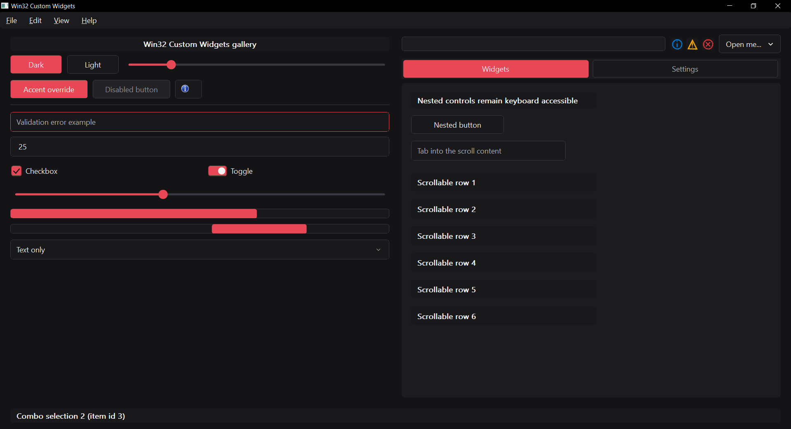

# Win32 Custom Widgets

A C++20 static library of custom-painted Win32 controls. It uses the Windows SDK, GDI/GDI+,
and the standard library. Text input uses native `EDIT` services; tabs use a native tab control
with fully custom painting.



## Add it to an application

Keep the library beside the consuming project and add it from CMake:

```cmake
add_subdirectory("${CMAKE_CURRENT_SOURCE_DIR}/../win32-custom-widgets" win32-custom-widgets)
target_link_libraries(MyApp PRIVATE Win32CustomWidgets::Win32CustomWidgets)
```

This is source-only integration: there is currently no install rule, package config, or exported
binary package. When this repository is the top-level project, `WCW_BUILD_DEMO` and CTest's
`BUILD_TESTING` default to `ON`. As an `add_subdirectory` dependency, the demo defaults to `OFF`
and WCW does not add its tests to the parent build. A parent may opt into the gallery with
`-DWCW_BUILD_DEMO=ON`.

Include `<wcw/Runtime.h>`, `<wcw/Theme.h>`, and `<wcw/Controls.h>`. Initialize once on the UI
thread after entering `wWinMain`, destroy every WCW window, then shut down on that same thread:

```cpp
if (!wcw::Initialize(instance)) return 1;
wcw::SetTheme(wcw::DarkTheme());
// Create the application window and WCW child controls, then run the message loop.
wcw::Shutdown();
```

All creation, mutation, theme, tooltip, and shutdown calls are UI-thread-affine. The caller owns
every `HICON` and `HBITMAP` supplied to a control; keep each handle alive while the control uses it
and destroy owned handles afterwards. Shared handles returned by `LoadIcon(nullptr, ...)` must not
be destroyed. Controls own their internal state and child windows.

## Themes and local styles

`DarkTheme()` and `LightTheme()` are complete presets. Copy a preset to change the global palette,
metrics, or fonts, then call `SetTheme`. `GetTheme()` returns the current theme by value.
`StyleOverride` changes only specified fields:

```cpp
auto theme = wcw::DarkTheme();
theme.metrics.cornerRadiusDip = 4;
theme.palette.accent = wcw::Color::FromRgb(80, 120, 240);
wcw::SetTheme(theme);

wcw::StyleOverride local;
local.background = wcw::Color::FromRgb(90, 55, 180);
local.cornerRadiusDip = 12;
wcw::SetStyleOverride(button, local); // ClearStyleOverride(button) restores the theme.
```

`SliderOptions` and `ScrollViewOptions` also expose `trackAppearance` and `thumbAppearance`, so
their parts can have independent colors, thicknesses, and corner radii.

## Controls and events

The public gallery includes Button (text, icon, or both), MenuBar, Label, ImageView, Separator, Panel,
TextBox, NumericBox, Checkbox, Toggle, Slider, ProgressBar, ComboBox, TabControl, ScrollView, and Tooltip. TextBox uses
native text services while its visible frame, states, and validation treatment are custom painted.

| Control | Features | Public APIs |
| --- | --- | --- |
| Button | Text/icon/bitmap, alignment, default/cancel actions, checked surface, mouse/Space/Enter activation | `CreateButton`, `SetChecked`, `GetChecked` |
| Menu button | Button appearance, nested popup tree, chevron, Down/Alt+Down activation | `CreateMenuButton`, `SetMenuItems` |
| Menu bar | Mnemonics, mouse and keyboard menu mode, root popup switching | `CreateMenuBar`, `SetMenuBarItems` |
| Context menu | Screen-coordinate placement, nested submenus, checked/disabled/separator rows, icons and shortcut labels | `ShowContextMenu` |
| Label | Left/center/right alignment, wrapping, ellipsis, vertical centering inside strict padding | `CreateLabel(options)`, `CreateLabel(options, alignment)` |
| ImageView | Native icons/bitmaps or built-in icons; contain, cover, stretch | `CreateImageView` |
| Separator / Panel | Horizontal or vertical separator; themed container surface and border | `CreateSeparator`, `CreatePanel` |
| TextBox | Unicode editing, IME, selection, clipboard, placeholder, password, read-only and validation frame | `CreateTextBox`, `SetTextBoxText`, `GetTextBoxText`, `SetValidationError` |
| NumericBox | Integer/floating input, range, step, arrow/wheel input, invalid intermediate text | `CreateNumericBox`, `SetNumericValue`, `GetNumericValue`; TextBox text/validation APIs also apply |
| Checkbox / Toggle | Boolean state, mouse and Space activation | `CreateCheckbox`, `CreateToggle`, `SetChecked`, `GetChecked` |
| Slider | Range/step, pointer drag, wheel, arrows, Home/End, Page Up/Down; independent track/thumb styles | `CreateSlider`, `SetSliderValue`, `GetSliderValue` |
| ProgressBar | Clamped determinate value or indeterminate animation while visible and enabled | `CreateProgressBar`, `SetProgressValue`, `GetProgressValue`, `SetProgressIndeterminate` |
| ComboBox | Text/icon/ID items, custom popup, scrolling, arrows/Home/End/Enter/Escape and prefix search | `CreateComboBox`, `SetComboItems`, `SetComboSelection`, `GetComboSelection` |
| TabControl | Fixed items with text/IDs, equal-width tabs, native keyboard navigation, custom appearance | `CreateTabControl`, `SetTabSelection`, `GetTabSelection` |
| ScrollView | Child HWND container, content extent/offset, wheel/keyboard input, draggable custom scrollbars | `CreateScrollView`, `GetScrollContentWindow`, `SetScrollContentExtent`, `SetScrollOffset`, `GetScrollOffset` |
| Tooltip | Wrapped non-activating popup, initial/reshow/autopop delays, maximum width and local appearance | `AttachTooltip`, `DetachTooltip`, `HideAllTooltips` |

All controls use `ControlOptions` for their parent, ID, DIP bounds, window style, text, accessible
name and local appearance. Set `WS_VISIBLE` to show a control at creation. Standard Win32 APIs
handle enabling, focus, visibility, positioning and destruction. `Panel` does not arrange children;
`ScrollView` exposes the HWND returned by `GetScrollContentWindow` as their parent.

### Labels and checked buttons

The one-argument `CreateLabel` keeps left alignment. The second argument accepts exactly
`DT_LEFT`, `DT_CENTER`, or `DT_RIGHT`; invalid values fail with `ERROR_INVALID_PARAMETER`.
Text wraps and is clipped/ellipsized inside the resolved padding, including in short controls.
Provide enough height for the font and vertical padding, or lower `paddingYDip` for compact labels:

```cpp
wcw::ControlOptions caption;
caption.parent = window;
caption.bounds = {20, 20, 240, 36};
caption.style = WS_VISIBLE;
caption.text = L"Centered caption";
HWND label = wcw::CreateLabel(caption, DT_CENTER);

wcw::ButtonOptions buttonOptions;
buttonOptions.parent = window;
buttonOptions.bounds = {20, 70, 160, 36};
buttonOptions.style = WS_VISIBLE;
buttonOptions.text = L"Current view";
buttonOptions.checked = true;
HWND selectedButton = wcw::CreateButton(buttonOptions);
wcw::SetChecked(selectedButton, false);
```

A checked Button/MenuButton uses the resolved `selected` surface and exposes the MSAA checked
state. Disabled, pressed and hover surfaces have priority. Clicking still sends the usual action;
the application controls the checked state. `SetChecked` does not generate a click or check-change
notification. Checkbox/Toggle continue to toggle themselves when activated.

### Text, values and images

`TextBoxOptions` supplies `placeholder`, `readOnly`, and `password`. `NumericBoxOptions` adds
`NumericMode`, `minimum`, `maximum`, `step`, and `value`. Numeric parsing uses a decimal point,
retains invalid intermediate input, and emits a value notification only for valid committed input.
Integer bounds must be integers; numeric ranges and values must be finite and steps positive.
`GetNumericValue` returns an empty optional while the current input is invalid. Numeric, slider
and progress getters also return an empty optional for invalid handles.

`ImageSource` accepts `HICON`, `HBITMAP`, or `BuiltinIcon::Information`, `Warning`, and `Error`.
Built-in icons are DPI-scaled outlines tinted by the host's foreground; native image colors are
preserved. `ComboItem` and `MenuItem` can carry the same image sources.

```cpp
wcw::ControlOptions image;
image.parent = window;
image.bounds = {200, 70, 24, 24};
image.style = WS_VISIBLE;
image.appearance.foreground = wcw::Color::FromRgb(0, 120, 212);
HWND information = wcw::CreateImageView(image, wcw::BuiltinIcon::Information);
```

### Menus

Menu bars are reusable child windows backed by the same `MenuItem` tree as menu buttons and context
menus:

```cpp
wcw::MenuBarOptions menu;
menu.parent = window;
menu.bounds = {0, 0, 800, 32};
menu.style = WS_VISIBLE;
menu.items = {
    {.text = L"&File", .children = {
        {.id = 1001, .text = L"E&xit"},
    }},
};
HWND menuBar = wcw::CreateMenuBar(menu);
```

Menu commands arrive through the parent `WM_COMMAND`: `LOWORD(wParam)` is the item ID and
`lParam` identifies the menu bar `HWND`. Use `&` for keyboard mnemonics (`&&` renders a literal
ampersand); `Alt`/`F10`, arrows, `Enter`, `Space`, and `Escape` provide standard menu navigation.
`ControlOptions::appearance` styles the bar and `MenuBarOptions::menuAppearance` styles its popups.
Calling `SetTheme` updates the menu bar and controls; newly opened menus use the current theme.
Use `SetMenuBarItems` to replace the item tree.

Context menus and menu buttons share the same `MenuItem` tree and renderer. Trees are copied;
native image handles remain caller-owned. Enabled leaf command IDs must be in `1..65535`.
Items with children open submenus; separators ignore their other fields. The application owns
checked-state changes and shortcut execution: `shortcut` is a displayed label, not an accelerator.

```cpp
wcw::ContextMenuOptions menuOptions;
menuOptions.items = {
    {.id = 1001, .text = L"Open", .shortcut = L"Ctrl+O"},
    {.separator = true},
    {.text = L"More", .children = {{.id = 1002, .text = L"Details"}}},
};
wcw::ShowContextMenu(window, screenPoint, menuOptions);
```

Popup entry points run a nested message loop and return after selection or cancellation. They
close all popup windows before synchronously delivering `WM_COMMAND`: its source `lParam` is
zero for context menus and the control HWND for menu buttons/bars. `ShowContextMenu` returns
true when a menu was shown, even if cancelled. Replacement through `SetMenuItems` or
`SetMenuBarItems` validates before mutation and closes the active hierarchy owned by that control.

Popups constrain placement to the monitor work area, use its DPI, and support enabled-row
Up/Down/Home/End navigation, Right/Left submenus, Enter/Space actions and Escape dismissal.
Pointer hover opens submenus after 200 ms. Outside input, owner destruction/disabling, and
activation loss dismiss menus. Menu bars and popups use system menu colors in High Contrast.

### Tabs and page windows

`TabControl` provides equally sized rounded tabs, selected/hover/
disabled colors, theme and style overrides, native keyboard navigation and MSAA tab roles.
It sends the same `WCN_SELECTION_CHANGED` notification as ComboBox. Use a distinct control ID
or check `header.hwndFrom` to distinguish them.

```cpp
wcw::TabControlOptions options;
options.parent = window;
options.id = 101;
options.bounds = {20, 20, 600, 44};
options.style = WS_VISIBLE;
options.accessibleName = L"Views";
options.items = {{L"Overview", 1}, {L"Settings", 2}};
HWND tabs = wcw::CreateTabControl(options);
```

The caller owns page content and layout. For separate windows, create two sibling child windows
below the strip, with the first visible and the second hidden. They can be application-defined
windows or WCW `ScrollView`s containing controls. Keep both alive to preserve input and scroll
state. Handle selection in the parent's window procedure (here `pages` contains those two HWNDs):

```cpp
case WM_NOTIFY: {
    if (const auto* change = wcw::DecodeSelectionChangedNotification(lParam, tabs)) {
        for (int i = 0; i < 2; ++i) {
            if (i != change->newIndex &&
                (GetFocus() == pages[i] || IsChild(pages[i], GetFocus()))) SetFocus(tabs);
            ShowWindow(pages[i], i == change->newIndex ? SW_SHOWNA : SW_HIDE);
        }
        return 0;
    }
    break;
}
```

For a shared drawing surface, use `change->newId` to choose what to draw and invalidate the
content window. The gallery demonstrates two persistent `ScrollView` pages.
`SetTabSelection(tabs, index)` also sends the notification synchronously when selection changes;
selecting the current index does nothing. `GetTabSelection` returns `-1` for an invalid handle.
Items must be nonempty and remain fixed for the lifetime of the control. The initial index is
clamped to the item range; later invalid indices are rejected. Do not insert/delete items via
native `TCM_*` messages, which would bypass the control's item state.

Use Tab to enter/leave the strip, arrows to focus a tab and Space to activate it. Give the strip
enough width for its captions (long text is ellipsized); the tab strip does
not add a scrolling or closable tab bar. Reposition the strip and page windows on resize/DPI
changes, just like other WCW controls.

### Notifications and accessibility

Buttons send `WM_COMMAND` with `BN_CLICKED`. Structured changes arrive through `WM_NOTIFY`:

| Code | Payload | Decoder |
| --- | --- | --- |
| `WCN_VALUE_CHANGED` | `ValueChangedNotification::value` | `DecodeValueChangedNotification(lParam, source)` |
| `WCN_CHECK_CHANGED` | `CheckChangedNotification::checked` | `DecodeCheckChangedNotification(lParam, source)` |
| `WCN_SELECTION_CHANGED` | `SelectionChangedNotification::oldIndex/newIndex/oldId/newId` | `DecodeSelectionChangedNotification(lParam, source)` |

Decoders return a const payload pointer only when the code and expected source HWND match;
otherwise they return null. Supply a valid payload from the current `WM_NOTIFY` handler and
consume it during that call. These helpers do not validate arbitrary memory addresses or
authenticate externally constructed messages. NumericBox and Slider produce value notifications;
Checkbox/Toggle produce check notifications; ComboBox/TabControl produce selection notifications.
Programmatic Slider/Checkbox/Toggle setters are silent; NumericBox, ComboBox and TabControl setters
notify synchronously on a change. Handle source HWNDs separately when several controls share a code.

Controls expose names, roles, states, values, focus and applicable default actions through MSAA
(`IAccessible`); menu entries are accessible children and password values are not exposed.
`ControlOptions::accessibleName` provides an explicit name at creation. Update it later without
changing a custom control's caption:

```cpp
wcw::SetAccessibleName(selectedButton, L"Current view: overview");
```

For custom controls, an empty name restores the creation-time text fallback. Tabs use native
MSAA; their window text stores the strip's accessible name, and an empty name clears it. Successful
name changes emit `EVENT_OBJECT_NAMECHANGE`. Name and checked-state setters reject invalid,
unrelated, destroyed and cross-thread HWNDs.

### Layout, DPI and geometry

The application owns layout. Bounds are expressed in DIPs at creation, but the application must
reposition controls on `WM_SIZE` and `WM_DPICHANGED` (the gallery demonstrates a small local
`MoveWindowDip` helper). Enable Per-Monitor-V2 awareness before creating windows. Use
`IsDialogMessage` in the message loop for Tab and dialog-key navigation.

`<wcw/Geometry.h>` exposes `DipToPx`, `PxToDip`, `ClampRadiusDip`, `SliderGeometry::ValueAt`, and
`ScrollbarGeometry` for applications that need the same conversions and thumb calculations.
Resolved styles are available through `ResolveStyle(theme, local)`. Theme changes retain local
overrides and invalidate controls; already-open popup menus are not repainted with a new theme.

## Build and run

Requires Windows 10 or later, MSVC with C++20 support, the Windows SDK, and CMake 3.21 or later.
Use a fresh build directory when changing the Visual Studio version.

```powershell
cmake -S . -B build -A x64 -DBUILD_TESTING=ON
cmake --build build --config Debug
ctest --test-dir build -C Debug --output-on-failure
.\build\bin\Debug\Win32CustomWidgetsDemo.exe
```

```powershell
cmake --build build --config Release
ctest --test-dir build -C Release --output-on-failure
.\build\bin\Release\Win32CustomWidgetsDemo.exe
```

Run GUI suites sequentially with the gallery closed. Tests cover painting, control input/state, ranges and parsing,
menus, accessibility, public API validation, and a separate `add_subdirectory` consumer build.

Use `-DWCW_BUILD_DEMO=OFF` for a library-and-tests top-level build or `-DBUILD_TESTING=OFF` for a
library-and-demo build without tests.

See [implementation status](docs/status.md) for the plan audit and remaining verification.

## Current non-goals

The library does not provide a layout engine, data binding, animation framework, renderer other
than GDI/GDI+, gamepad input, or cross-platform support. It does not copy or take ownership of
caller-supplied image handles.

## License

[MIT](LICENSE).
